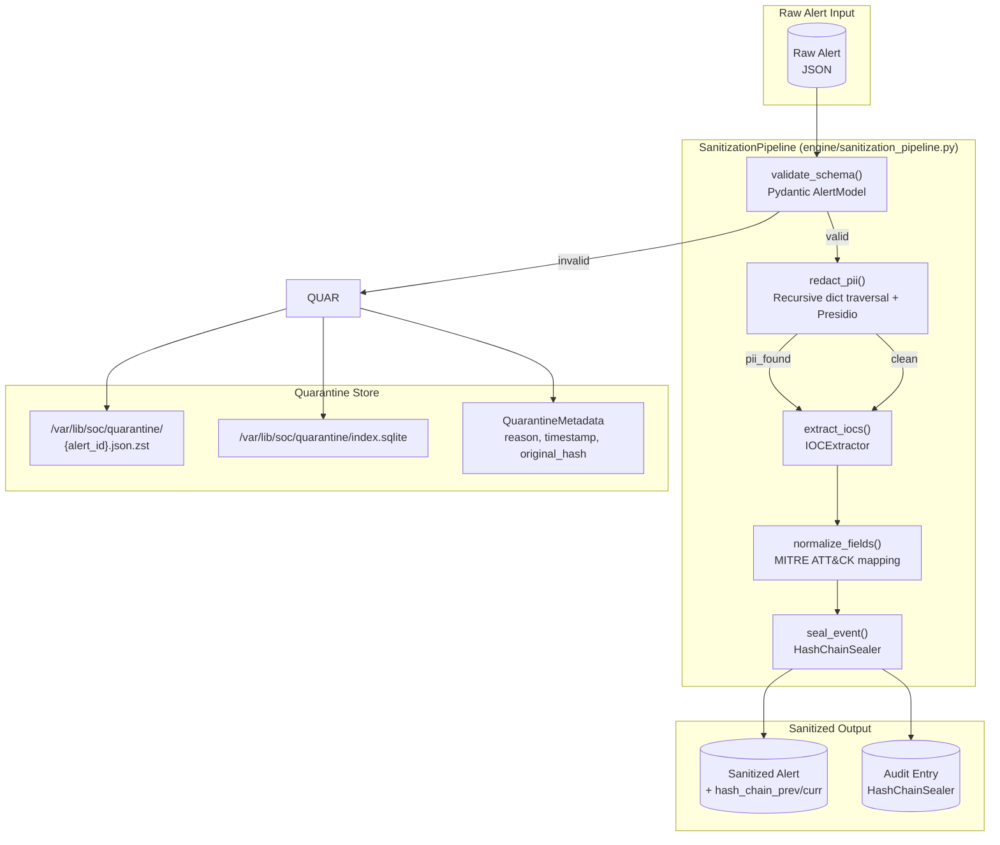
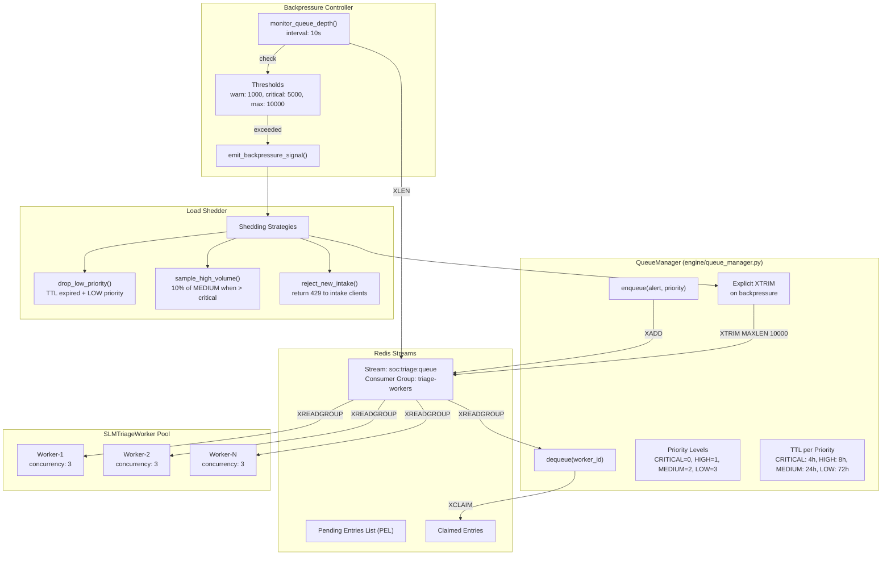
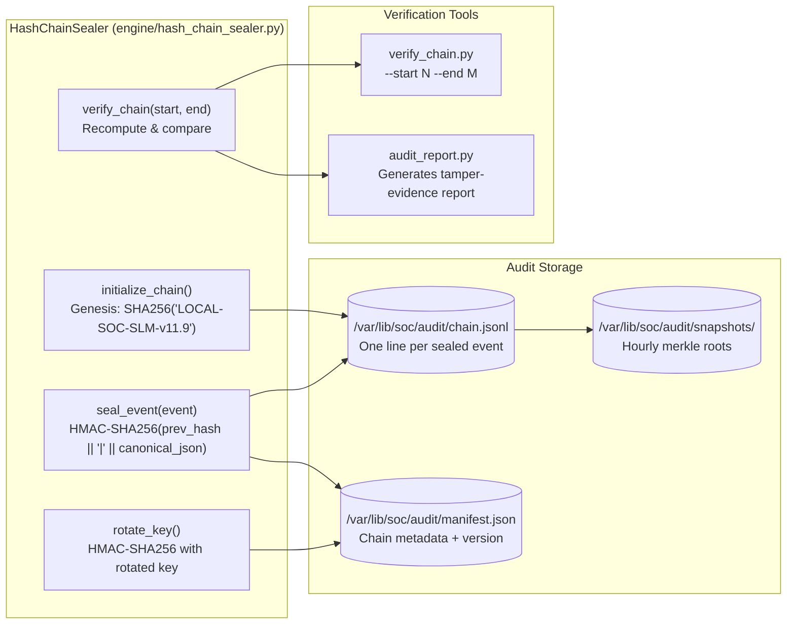
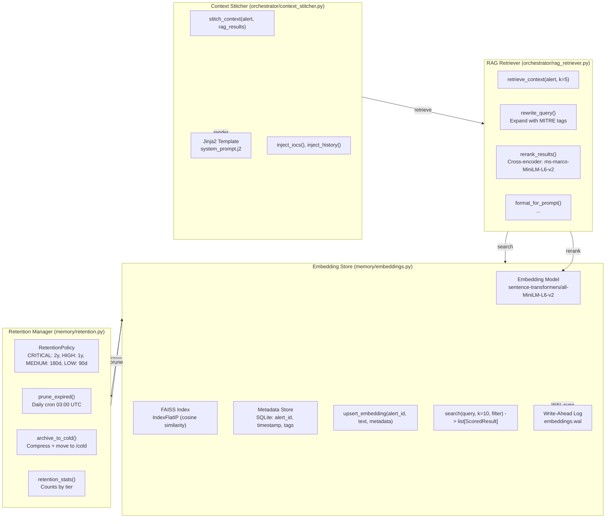
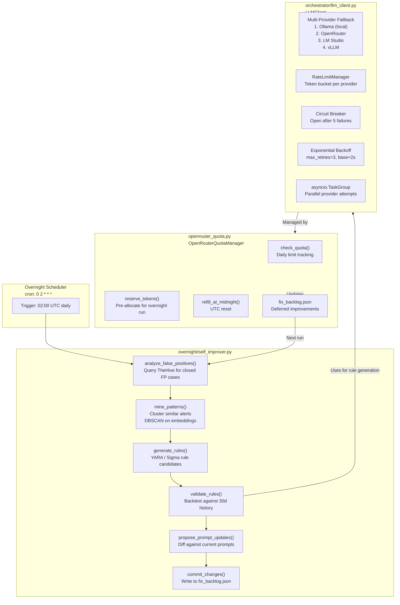

# LOCAL-SOC-SLM Architecture Document (v11.9)

## Overview

LOCAL-SOC-SLM is a local Security Operations Center automation platform that processes security alerts from Wazuh, enriches them through local SLM triage, and writes actionable cases to TheHive. Version 11.9 introduces the **Overnight Self-Improving Pipeline**, which leverages historical case outcomes to refine detection logic and prompt engineering, supported by a resilient multi-provider LLM client with quota management.

---

## 1. End-to-End Data Flow: Wazuh Intake → TheHive Writeback

```mermaid
flowchart TD
    subgraph INTAKE["Intake Layer"]
        WZ[("Wazuh Manager\n/var/ossec/logs/alerts/alerts.json")]
        IW["engine/intake_wazuh.py\nWazuhIntakeClient"]
        IE["engine/intake_eve.py\nEVEIntakeClient"]
        KAFKA[("Kafka Topic\nwazuh-alerts")]
    end

    subgraph SANITIZE["Sanitization Pipeline"]
        SP["engine/sanitization_pipeline.py\nSanitizationPipeline"]
        QUAR[("Quarantine Store\n/var/lib/soc/quarantine/")]
        HCS["engine/hash_chain_sealer.py\nHashChainSealer"]
    end

    subgraph QUEUE["Queue Management"]
        QM["engine/queue_manager.py\nQueueManager"]
        PQ[("Priority Queue\nRedis Streams")]
        BP["Backpressure Controller"]
        SHED["Load Shedder"]
    end

    subgraph TRIAGE["SLM Triage Worker"]
        STW["engine/slm_triage_worker.py\nSLMTriageWorker"]
        MR["orchestrator/model_registry.py\nModelRegistry"]
        CS["orchestrator/context_stitcher.py\nContextStitcher"]
        QL["engine/quota_ledger.py\nQuotaLedger"]
        LLM["orchestrator/llm_client.py\nLLMClient"]
    end

    subgraph ENRICH["Enrichment & IOC"]
        ES["engine/enrichment_scheduler.py\nEnrichmentScheduler"]
        IOCE["engine/ioc_extractor.py\nIOCExtractor"]
        VT[("VirusTotal / AbuseIPDB\nExternal APIs")]
    end

    subgraph WRITEBACK["TheHive Writeback"]
        WB["engine/writeback_thehive.py\nTheHiveWriteback"]
        TH[("TheHive Instance\n/api/v1/cases")]
    end

    subgraph MEMORY["Memory / RAG Layer"]
        RET["memory/retention.py\nRetentionManager"]
        EMB["memory/embeddings.py\nEmbeddingStore"]
        RAG["orchestrator/rag_retriever.py\nRAGRetriever"]
    end

    subgraph AUDIT["Hash Chain Audit Trail"]
        HC[("Hash Chain\n/var/lib/soc/audit/chain.jsonl")]
        SEAL["Seal Interval: 100 events\nor 5 minutes"]
    end

    WZ -->|tail -f / filebeat| IW
    IE -->|Suricata EVE JSON| KAFKA
    IW -->|normalize_to_alert()| KAFKA
    KAFKA -->|consume_batch()| SP
    SP -->|sanitize()| QUAR
    SP -->|seal_event()| HCS
    HCS -->|append_hash()| HC
    SP -->|enqueue()| QM
    QM -->|push_with_priority()| PQ
    PQ -->|backpressure_check()| BP
    BP -->|shed_if_overloaded()| SHED
    PQ -->|pop_next()| STW
    STW -->|get_model()| MR
    STW -->|stitch_context()| CS
    CS -->|retrieve()| RAG
    RAG -->|search()| EMB
    STW -->|check_quota()| QL
    STW -->|triage_alert()| ES
    ES -->|schedule_enrichment()| IOCE
    IOCE -->|extract_iocs()| VT
    STW -->|call_llm()| LLM
    LLM -->|multi-provider fallback| MR
    STW -->|write_case()| WB
    WB -->|create_case()| TH
    STW -->|update_retention()| RET
    RET -->|prune_expired()| EMB
```

### Key Data Structures

**Normalized Alert (engine/intake_wazuh.py:normalize_to_alert)**
```python
{
    "alert_id": "wazuh-20241219-001234",
    "timestamp": "2024-12-19T14:32:11.456Z",
    "source": "wazuh",
    "rule": {"id": "5715", "level": 12, "description": "SSH brute force"},
    "agent": {"id": "001", "name": "web-01", "ip": "10.0.1.15"},
    "data": {"srcip": "203.0.113.45", "dstport": 22, "attempts": 47},
    "raw": {...}
}
```

**Sanitized Alert (engine/sanitization_pipeline.py:sanitize)**
```python
{
    "alert_id": "wazuh-20241219-001234",
    "sanitized": True,
    "pii_redacted": ["user", "password", "email"],
    "iocs": [{"type": "ip", "value": "203.0.113.45"}],
    "hash_chain_prev": "a3f2...",
    "hash_chain_curr": "7b9e..."
}
```

---

## 2. Sanitization Pipeline & Quarantine Mechanism



### SanitizationPipeline Class (engine/sanitization_pipeline.py)

```python
class SanitizationPipeline:
    def __init__(self, quarantine_dir: Path, hash_sealer: HashChainSealer):
        self.quarantine = QuarantineStore(quarantine_dir)
        self.sealer = hash_sealer
        self.analyzer = PresidioAnalyzer()
        self.ioc_extractor = IOCExtractor()

    def sanitize(self, raw_alert: dict) -> SanitizedAlert:
        alert = AlertModel(**raw_alert)
        redacted, pii_found = self._redact_pii(alert.model_dump())
        iocs = self.ioc_extractor.extract(redacted)
        normalized = self._normalize_fields(redacted, iocs)
        prev_hash = self.sealer.get_latest_hash()
        curr_hash = self.sealer.seal(normalized)
        normalized["hash_chain_prev"] = prev_hash
        normalized["hash_chain_curr"] = curr_hash
        return SanitizedAlert(**normalized)

    def _redact_pii(self, data: dict) -> tuple[dict, list[str]]:
        found = []
        def _traverse(obj: Any, path: str = "") -> Any:
            if isinstance(obj, dict):
                return {k: _traverse(v, f"{path}.{k}") for k, v in obj.items()}
            elif isinstance(obj, list):
                return [_traverse(v, f"{path}[{i}]") for i, v in enumerate(obj)]
            elif isinstance(obj, str):
                results = self.analyzer.analyze(text=obj, entities=["PERSON", "EMAIL_ADDRESS", "PHONE_NUMBER", "CREDIT_CARD", "IP_ADDRESS"], language="en")
                redacted_text = obj
                for result in sorted(results, key=lambda r: r.start, reverse=True):
                    found.append(f"{path}:{result.entity_type}")
                    redacted_text = redacted_text[:result.start] + "[REDACTED]" + redacted_text[result.end:]
                return redacted_text
            return obj
        return _traverse(data), found
```

### QuarantineStore (engine/sanitization_pipeline.py:QuarantineStore)

```python
class QuarantineStore:
    def __init__(self, base_dir: Path):
        self.base_dir = base_dir
        self.base_dir.mkdir(parents=True, exist_ok=True)
        self.index = sqlite3.connect(base_dir / "index.sqlite")
        self.index.execute("PRAGMA journal_mode=WAL")
        self._init_index()

    def _init_index(self):
        self.index.execute("""
            CREATE TABLE IF NOT EXISTS quarantine (
                alert_id TEXT PRIMARY KEY,
                timestamp TEXT NOT NULL,
                reason TEXT NOT NULL,
                original_hash TEXT NOT NULL,
                path TEXT NOT NULL
            )
        """)
        self.index.commit()

    def quarantine(self, alert_id: str, raw: dict, reason: str) -> Path:
        timestamp = datetime.utcnow().isoformat()
        original_hash = hashlib.sha256(json.dumps(raw, sort_keys=True).encode()).hexdigest()
        compressed = zstd.compress(json.dumps(raw, sort_keys=True).encode())
        qfile = self.base_dir / f"{alert_id}.json.zst"
        tmp_file = self.base_dir / f".{alert_id}.tmp"
        tmp_file.write_bytes(compressed)
        tmp_file.replace(qfile)
        self.index.execute(
            "INSERT OR REPLACE INTO quarantine VALUES (?, ?, ?, ?, ?)",
            (alert_id, timestamp, reason, original_hash, str(qfile))
        )
        self.index.commit()
        return qfile

    def retrieve(self, alert_id: str) -> dict | None:
        row = self.index.execute(
            "SELECT path FROM quarantine WHERE alert_id = ?", (alert_id,)
        ).fetchone()
        if row:
            return json.loads(zstd.decompress(Path(row[0]).read_bytes()))
        return None
```

---

## 3. Triage Queue with Backpressure & Load Shedding



### QueueManager Implementation (engine/queue_manager.py)

```python
class QueueManager:
    PRIORITY_MAP = {"CRITICAL": 0, "HIGH": 1, "MEDIUM": 2, "LOW": 3}
    TTL_MAP = {"CRITICAL": 14400, "HIGH": 28800, "MEDIUM": 86400, "LOW": 259200}
    BACKPRESSURE_THRESHOLDS = {"warn": 1000, "critical": 5000, "max": 10000}
    MAX_STREAM_LENGTH = 10000

    def __init__(self, redis_client: redis.Redis, stream_key: str = "soc:triage:queue"):
        self.redis = redis_client
        self.stream_key = stream_key
        self.consumer_group = "triage-workers"
        self._ensure_group()

    def _ensure_group(self):
        try:
            self.redis.xgroup_create(self.stream_key, self.consumer_group, id="0", mkstream=True)
        except redis.ResponseError as e:
            if "BUSYGROUP" not in str(e):
                raise

    def enqueue(self, alert: SanitizedAlert, priority: str = "MEDIUM") -> str:
        priority_val = self.PRIORITY_MAP.get(priority, 2)
        ttl = self.TTL_MAP.get(priority, 86400)
        entry = {
            "alert_id": alert.alert_id,
            "payload": json.dumps(alert.model_dump(), sort_keys=True),
            "priority": str(priority_val),
            "enqueued_at": datetime.utcnow().isoformat(),
            "ttl": str(ttl),
            "attempts": "0"
        }
        msg_id = self.redis.xadd(self.stream_key, entry)
        return msg_id

    def dequeue(self, worker_id: str, count: int = 10, block_ms: int = 5000) -> list[QueuedAlert]:
        claimed = self._claim_pending(worker_id, count)
        if claimed:
            return claimed
        streams = {self.stream_key: ">"}
        results = self.redis.xreadgroup(self.consumer_group, worker_id, streams, count, block_ms)
        return [self._parse_entry(msg_id, data) for _, msgs in results for msg_id, data in msgs]

    def monitor_backpressure(self) -> BackpressureStatus:
        length = self.redis.xlen(self.stream_key)
        if length >= self.BACKPRESSURE_THRESHOLDS["max"]:
            return BackpressureStatus.MAX_EXCEEDED
        elif length >= self.BACKPRESSURE_THRESHOLDS["critical"]:
            return BackpressureStatus.CRITICAL
        elif length >= self.BACKPRESSURE_THRESHOLDS["warn"]:
            return BackpressureStatus.WARN
        return BackpressureStatus.NORMAL

    def shed_load(self, status: BackpressureStatus) -> ShedResult:
        if status == BackpressureStatus.MAX_EXCEEDED:
            self.redis.xtrim(self.stream_key, maxlen=self.MAX_STREAM_LENGTH, approximate=False)
            dropped = self._drop_expired_priority("LOW")
            sampled = self._sample_priority("MEDIUM", 0.1)
            return ShedResult(dropped=dropped, sampled=sampled, rejected_new=True)
        elif status == BackpressureStatus.CRITICAL:
            dropped = self._drop_expired_priority("LOW")
            return ShedResult(dropped=dropped, rejected_new=False)
        return ShedResult()

    def _drop_expired_priority(self, priority: str) -> int:
        priority_val = str(self.PRIORITY_MAP[priority])
        pass

    def _sample_priority(self, priority: str, rate: float) -> int:
        pass
```

---

## 4. Hash Chain Audit Trail



### HashChainSealer (engine/hash_chain_sealer.py)

```python
class HashChainSealer:
    VERSION = 1
    DELIMITER = b"|"

    def __init__(self, chain_path: Path, key_rotation_interval: int = 86400):
        self.chain_path = chain_path
        self.chain_path.parent.mkdir(parents=True, exist_ok=True)
        self.current_key = self._load_or_generate_key()
        self.key_rotation_interval = key_rotation_interval
        self.last_rotation = time.time()
        self._lock = asyncio.Lock()
        self._latest_hash = self._get_latest_hash()
        self._seq = self._get_latest_sequence()

    def seal(self, event: dict) -> str:
        async with self._lock:
            canonical = json.dumps(event, sort_keys=True, separators=(",", ":"))
            message = self._latest_hash.encode() + self.DELIMITER + canonical.encode()
            hmac_digest = hmac.new(
                self.current_key,
                message,
                hashlib.sha256
            ).hexdigest()
            self._seq += 1
            entry = {
                "version": self.VERSION,
                "seq": self._seq,
                "timestamp": datetime.utcnow().isoformat(),
                "prev_hash": self._latest_hash,
                "curr_hash": hmac_digest,
                "event_hash": hashlib.sha256(canonical.encode()).hexdigest(),
                "key_id": self._get_key_id()
            }
            with open(self.chain_path, "a") as f:
                f.write(json.dumps(entry) + "\n")
            self._latest_hash = hmac_digest
            self._maybe_rotate_key()
            return hmac_digest

    def verify_range(self, start_seq: int, end_seq: int) -> VerificationResult:
        mismatches = []
        expected_prev = "genesis" if start_seq == 1 else None
        with open(self.chain_path) as f:
            for line in f:
                entry = json.loads(line)
                if entry["seq"] < start_seq:
                    if entry["seq"] == start_seq - 1:
                        expected_prev = entry["curr_hash"]
                    continue
                if entry["seq"] > end_seq:
                    break
                if expected_prev is not None and entry["prev_hash"] != expected_prev:
                    mismatches.append({"seq": entry["seq"], "reason": "chain_break"})
                    continue
                expected = self._recompute_hash(entry, expected_prev)
                if expected != entry["curr_hash"]:
                    mismatches.append({"seq": entry["seq"], "reason": "hash_mismatch"})
                expected_prev = entry["curr_hash"]
        return VerificationResult(valid=len(mismatches)==0, mismatches=mismatches)

    def _maybe_rotate_key(self):
        if time.time() - self.last_rotation > self.key_rotation_interval:
            self.current_key = secrets.token_bytes(32)
            self.last_rotation = time.time()
            self._update_manifest({
                "key_rotation": self.last_rotation, 
                "key_id": self._get_key_id(),
                "seq_at_rotation": self._seq
            })
```

### Chain Entry Format (chain.jsonl)

```json
{"version": 1, "seq": 1, "timestamp": "2024-12-19T14:32:11.456Z", "prev_hash": "genesis", "curr_hash": "a3f2...", "event_hash": "7b9e...", "key_id": "key-1"}
{"version": 1, "seq": 2, "timestamp": "2024-12-19T14:32:15.123Z", "prev_hash": "a3f2...", "curr_hash": "4c8d...", "event_hash": "f1a2...", "key_id": "key-1"}
```

---

## 5. Memory / RAG Layer



### EmbeddingStore (memory/embeddings.py)

```python
class EmbeddingStore:
    def __init__(self, index_path: Path, meta_db: Path, model_name: str = "all-MiniLM-L6-v2", wal_path: Path = None):
        self.model = SentenceTransformer(model_name)
        self.dimension = 384
        self.index = faiss.IndexFlatIP(self.dimension)
        self.index_path = index_path
        self.meta_db = sqlite3.connect(meta_db)
        self.meta_db.execute("PRAGMA journal_mode=WAL")
        self._init_meta()
        self._load_index()
        self.wal_path = wal_path or index_path.with_suffix(".wal")
        self.wal_buffer = []
        self.wal_flush_interval = 10

    def _init_meta(self):
        self.meta_db.execute("""
            CREATE TABLE IF NOT EXISTS embeddings (
                faiss_id INTEGER PRIMARY KEY,
                alert_id TEXT UNIQUE NOT NULL,
                metadata TEXT NOT NULL,
                created_at TEXT NOT NULL,
                text_preview TEXT
            )
        """)
        self.meta_db.commit()

    def upsert(self, alert_id: str, text: str, metadata: dict) -> None:
        embedding = self.model.encode([text], normalize_embeddings=True)[0]
        faiss_id = self.index.ntotal
        self.index.add(np.array([embedding], dtype=np.float32))
        self.meta_db.execute(
            "INSERT OR REPLACE INTO embeddings VALUES (?, ?, ?, ?, ?)",
            (faiss_id, alert_id, json.dumps(metadata), datetime.utcnow().isoformat(), text[:500])
        )
        self.meta_db.commit()
        self.wal_buffer.append({
            "op": "upsert",
            "faiss_id": faiss_id,
            "alert_id": alert_id,
            "embedding": embedding.tolist(),
            "metadata": metadata
        })
        if len(self.wal_buffer) >= self.wal_flush_interval:
            self.persist()

    def persist(self) -> None:
        faiss.write_index(self.index, str(self.index_path))
        if self.wal_buffer:
            with open(self.wal_path, "a") as f:
                for entry in self.wal_buffer:
                    f.write(json.dumps(entry) + "\n")
            self.wal_buffer.clear()

    def search(self, query: str, k: int = 10, filter_tags: list[str] = None) -> list[ScoredResult]:
        query_emb = self.model.encode([query], normalize_embeddings=True)[0]
        scores, indices = self.index.search(np.array([query_emb], dtype=np.float32), k * 3)
        results = []
        for score, idx in zip(scores[0], indices[0]):
            if idx == -1:
                continue
            row = self.meta_db.execute(
                "SELECT alert_id, metadata, text_preview FROM embeddings WHERE faiss_id = ?", (int(idx),)
            ).fetchone()
            if row and (not filter_tags or any(tag in json.loads(row[1]).get("tags", []) for tag in filter_tags)):
                results.append(ScoredResult(alert_id=row[0], score=float(score), metadata=json.loads(row[1]), preview=row[2]))
                if len(results) >= k:
                    break
        return results

    def prune_expired(self, retention_policy: RetentionPolicy) -> int:
        cutoff = datetime.utcnow() - timedelta(days=retention_policy.max_days)
        expired = self.meta_db.execute(
            "SELECT faiss_id FROM embeddings WHERE created_at < ?", (cutoff.isoformat(),)
        ).fetchall()
        if expired:
            keep_ids = set(range(self.index.ntotal)) - {row[0] for row in expired}
            self._rebuild_index(keep_ids)
            self.meta_db.execute("DELETE FROM embeddings WHERE created_at < ?", (cutoff.isoformat(),))
            self.meta_db.commit()
            self.persist()
        return len(expired)

    def _rebuild_index(self, keep_ids: set[int]):
        all_vectors = faiss.vector_to_array(self.index).reshape(self.index.ntotal, self.dimension)
        kept_vectors = all_vectors[list(sorted(keep_ids))]
        self.index = faiss.IndexFlatIP(self.dimension)
        if len(kept_vectors) > 0:
            self.index.add(kept_vectors)
```

### RAGRetriever (orchestrator/rag_retriever.py)

```python
class RAGRetriever:
    def __init__(self, embedding_store: EmbeddingStore, reranker_model: str = "cross-encoder/ms-marco-MiniLM-L6-v2"):
        self.store = embedding_store
        self.reranker = CrossEncoder(reranker_model)

    def retrieve_context(self, alert: SanitizedAlert, k: int = 5) -> list[ContextChunk]:
        query_parts = [
            alert.rule.get("description", ""),
            " ".join([ioc["value"] for ioc in alert.iocs]),
            alert.agent.get("name", ""),
            " ".join(alert.mitre_tags or [])
        ]
        query = " ".join(filter(None, query_parts))
        expanded = self._expand_query(query, alert.mitre_tags)
        candidates = self.store.search(expanded, k=k*3, filter_tags=alert.mitre_tags)
        if not candidates:
            return []
        pairs = [(expanded, c.preview) for c in candidates]
        rerank_scores = self.reranker.predict(pairs)
        for c, score in zip(candidates, rerank_scores):
            c.rerank_score = float(score)
        candidates.sort(key=lambda x: x.rerank_score, reverse=True)
        return [ContextChunk(
            alert_id=c.alert_id,
            text=c.preview,
            metadata=c.metadata,
            relevance=c.rerank_score
        ) for c in candidates[:k]]

    def format_for_prompt(self, chunks: list[ContextChunk]) -> str:
        if not chunks:
            return "<context>No relevant historical cases found.</context>"
        parts = ["<context>"]
        for i, chunk in enumerate(chunks, 1):
            parts.append(f"  <case id=\"{chunk.alert_id}\" relevance=\"{chunk.relevance:.3f}\">")
            parts.append(f"    <summary>{chunk.text}</summary>")
            parts.append(f"    <tags>{', '.join(chunk.metadata.get('tags', []))}</tags>")
            parts.append(f"    <outcome>{chunk.metadata.get('outcome', 'unknown')}</outcome>")
            parts.append(f"  </case>")
        parts.append("</context>")
        return "\n".join(parts)
```

---

## 6. Overnight Self-Improving Pipeline (v11.9)



### SelfImprover (overnight/self_improver.py)

```python
class SelfImprover:
    def __init__(
        self,
        hive_client: TheHiveClient,
        embedding_store: EmbeddingStore,
        llm_client: LLMClient,
        quota_manager: OpenRouterQuotaManager,
        backlog_path: Path = Path("/var/lib/soc/fix_backlog.json")
    ):
        self.hive = hive_client
        self.embeddings = embedding_store
        self.llm = llm_client
        self.quota = quota_manager
        self.backlog_path = backlog_path
        self.backlog = self._load_backlog()

    async def run(self) -> ImprovementReport:
        if not await self.quota.reserve_tokens(estimated=50000):
            logger.warning("Insufficient OpenRouter quota, deferring to backlog")
            return ImprovementReport
## Recent Architectural Additions (v11.9+)

### 1. Bounded Syntax-Repair Loop
The `overnight/self_improver.py` whole-file generation path now includes a strictly bounded 2-attempt repair loop.
- **Attempt 1:** Generates candidate. If `ast.parse()` fails, captures `SyntaxError.msg`, `lineno`, `offset`, and the broken code.
- **Attempt 2:** Feeds the exact diagnostic feedback back to the LLM to repair its own truncation/syntax errors.
- **Invariant:** Maximum 2 attempts. Never writes invalid syntax to disk. Downstream `pytest` gates remain untouched.

### 2. Telemetry & NAS Evacuation (Outbox Pattern)
To measure model efficacy without risking the 30GB root filesystem (`/dev/sda`), a fail-open telemetry system was deployed:
- **Stage 1 (Writer):** `engine/telemetry.py` appends JSONL events to a local buffer capped strictly at 50MB.
- **Stage 2 (Syncer):** `tools/sync_telemetry.py` runs via cron every 5 minutes. It verifies the NAS mount via `st_dev` comparison (Root=2050 vs NAS=2080) to prevent writing to the root disk if the NAS drops, then uses `rsync --remove-source-files` to evacuate to `/dev/sdc`.
