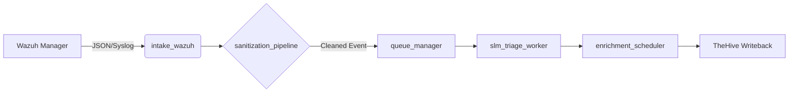
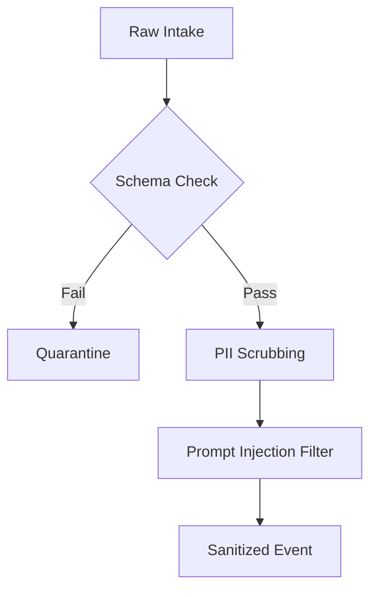
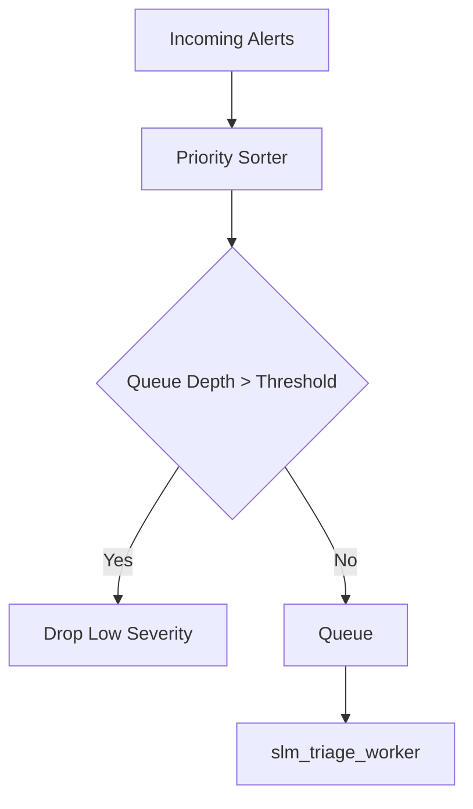
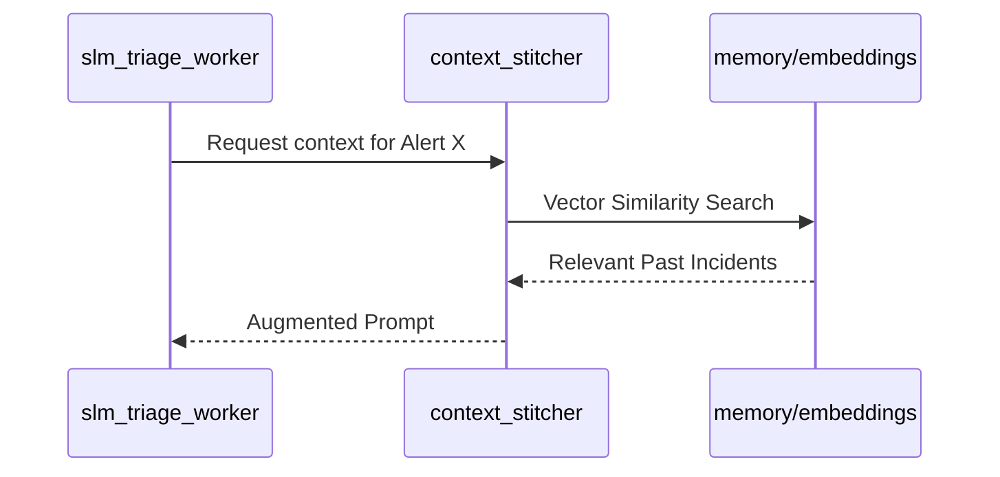

# LOCAL-SOC-SLM Architecture Documentation

## 1. System Overview
LOCAL-SOC-SLM is a local-first, privacy-preserving Security Operations Center automation platform. It leverages Small Language Models (SLMs) to perform autonomous triage, enrichment, and response orchestration, ensuring that sensitive security telemetry never leaves the local infrastructure.

## 2. Data Flow: Wazuh to TheHive
The data pipeline follows a strictly asynchronous, event-driven architecture.

1. **`intake_wazuh`**: Listens for Wazuh alerts via API or file-beat. It normalizes raw JSON into the internal `SOCEvent` schema.
2. **`queue_manager`**: Acts as the central broker, managing priority levels for incoming alerts.
3. **`slm_triage_worker`**: Pulls from the queue, invokes the `orchestrator` for model routing, and generates an incident summary.
4. **`TheHive Writeback`**: Finalizes the incident creation in TheHive via API, attaching the SLM-generated analysis.

## 3. Sanitization Pipeline and Quarantine
To prevent prompt injection and ensure data hygiene, all incoming events pass through the `sanitization_pipeline`.

*   **Mechanism**:
    *   **Regex Scrubbing**: Removes PII (IPs, emails, usernames) if configured for anonymized training.
    *   **Schema Validation**: Rejects malformed JSON using `pydantic` models.
    *   **Quarantine**: Events failing validation are moved to `storage/quarantine/` with a metadata tag indicating the failure reason (e.g., `ERR_INVALID_SCHEMA`).

## 4. Triage Queue, Backpressure, and Shedding
The `queue_manager` implements a token-bucket algorithm to prevent SLM exhaustion.

*   **Backpressure**: When the `slm_triage_worker` latency exceeds 5000ms, the `queue_manager` signals the `intake_wazuh` module to slow down ingestion.
*   **Shedding**: If the queue depth exceeds `MAX_QUEUE_SIZE` (default: 10,000), the system drops "Low" severity alerts to preserve resources for "Critical" and "High" alerts.

## 5. Hash Chain Audit Trail
Every action taken by the SLM is cryptographically linked to the previous state using `hash_chain_sealer`.

*   **Structure**: Each entry contains:
    *   `prev_hash`: SHA-256 of the previous record.
    *   `event_id`: The Wazuh alert ID.
    *   `model_output`: The SLM response.
    *   `signature`: HMAC-SHA256 of the object.
*   **Purpose**: Ensures that incident response logs cannot be tampered with by an attacker who gains access to the local storage.

## 6. Memory and RAG Layer
The `memory/` module provides context to the SLM, allowing it to recall previous incidents or internal documentation.

*   **`embeddings`**: Converts incident summaries into vector representations using local models (e.g., `all-MiniLM-L6-v2`).
*   **`retention`**: Manages the lifecycle of vectors; entries older than 90 days are moved to cold storage or purged.
*   **RAG Flow**:
    1. `slm_triage_worker` queries `context_stitcher`.
    2. `context_stitcher` performs a vector similarity search in `memory/embeddings`.
    3. Retrieved context is injected into the SLM prompt as `<context>...</context>`.

## 7. Configuration Reference
- `engine/quota_ledger`: Tracks token usage per model.
- `orchestrator/model_registry`: Defines which SLM (e.g., Llama-3, Mistral) is used for specific alert types.
- `engine/ioc_extractor`: Automatically parses IPs, hashes, and domains from `intake_eve` logs for enrichment.

## 8. Operational Guidelines
1. **Monitoring**: Check `logs/system.log` for backpressure triggers.
2. **Maintenance**: Run `python scripts/prune_memory.py` monthly to clear expired embeddings.
3. **Security**: The `hash_chain_sealer` key should be stored in a local environment variable `SOC_HMAC_KEY` and never committed to version control.
4. **Triage**: If the SLM is consistently misclassifying, update the `model_registry` to point to a more capable local model or refine the `context_stitcher` prompt templates.